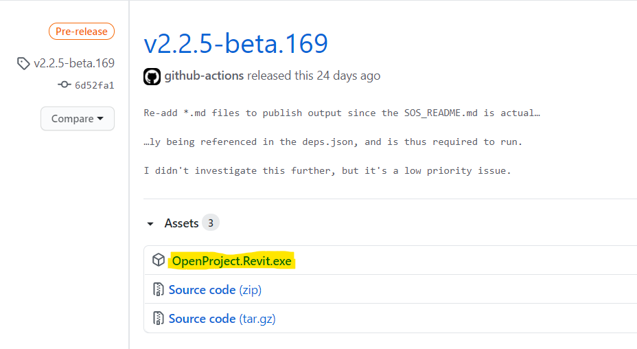
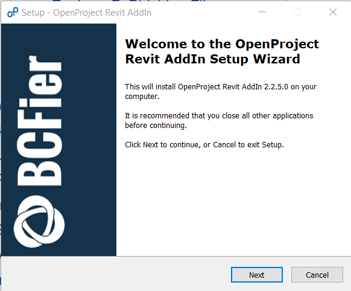
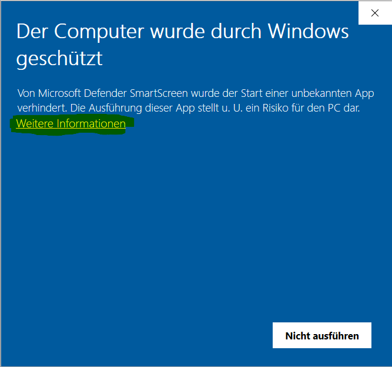
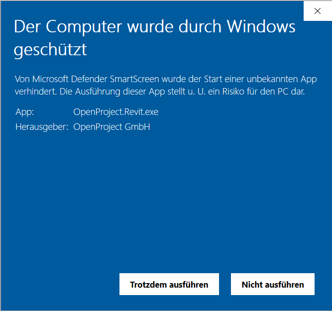

# Installation Instructions

To install the **OpenProject Revit AddIn**, please follow these instructions.

## System Requirements

The **OpenProject Revit AddIn** does not have any special system requirements. Autodesk Revit must be installed. The following versions of Revit are supported:

- 2019
- 2020
- 2021

## Download the Installer

To download the setup application for the **OpenProject Revit AddIn**, please go to [https://github.com/opf/openproject-revit-add-in/releases/latest](https://github.com/opf/openproject-revit-add-in/releases/latest) to download the installer. When on the download page, please click on _OpenProject.Revit.exe_ to download it.

## Installation

After you have downloaded the file, please run it to start the installation process.

In the first screen, click _Next_ to continue:

Next, select the Revit version you have installed locally and click _Next_ to continue. You can select multiple versions:

Verify the installation steps are correct in the next screen and click on _Install_ to install the **OpenProject Revit AddIn**:

Please wait a few moments for the installation to complete and then click _Finish_ to finish the installation.

## Running the OpenProject Revit AddIn

Once you have installed the AddIn, you should see a new tab _OpenProject_ in Revits Ribbon Bar at the top:

Open this tab and click on _OpenProject_ to launch the **OpenProject Revit AddIn**.

## Update from an Earlier Version

If you already have an earlier version installed, simply follow the same steps as for a new installation. The existing **OpenProject Revit AddIn** will be updated.

## Troubleshooting

### 'Your computer was protected by Windows' Error Message

This is an internal Windows defense mechanism called _Windows SmartScreen_. When you run the installer, you might see a message similar to this:

This can happen when a new release was not yet installed by many users, so internal Microsoft services do not yet know about the trustworthiness of the **OpenProject Revit AddIn** version.

To continue, please click on the highlighted part labeled _Additional Information_, then you should see a screen like the following:

Ensure that publisher says _OpenProject GmbH_. That means the installer was correctly signed by OpenProject and is safe to use.

To proceed with the installation, click on _Run Anyway_ and the installation will start.
